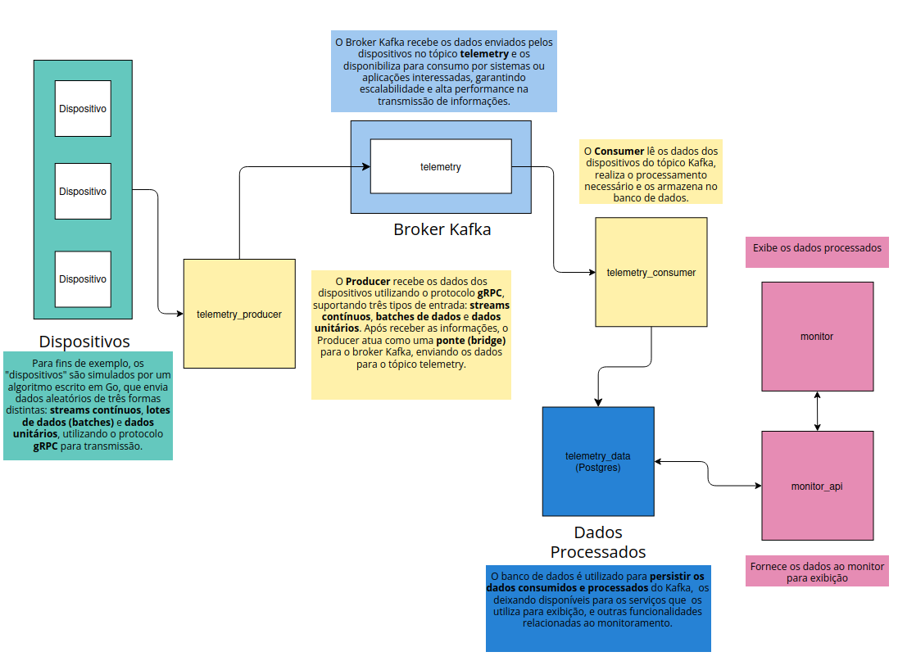

# Processo seletivo Intelbras – Sistema de Mensageria para Telemetria Veicular

## Introdução
O objetivo deste projeto é estruturar um sistema de mensageria para dados de telemetria veicular. O sistema é composto por diversas partes, como o **devices_mock**, **telemetry_producer**, **telemetry_consumer**, **monitor_api** e o **monitor** (frontend). As soluções foram desenvolvidas utilizando as tecnologias Go, Kafka, gRPC, Postgres e Next.js.

## Estrutura do Projeto

Este projeto é composto pelos seguintes componentes:

### 1. **devices_mock** (Go)
Um mock que gera dados de telemetria para simular as informações que serão enviadas para o produtor. Esse mock simula dispositivos que geram dados de forma contínua, como se fossem dispositivos reais de telemetria.

### 2. **telemetry_producer** (Go)
Aplicação que recebe os dados gerados pelo `devices_mock` via gRPC e os envia como mensagens para o Kafka onde serão consumidos por outros sistemas.

### 3. **telemetry_consumer** (Go)
Consumidor que recebe as mensagens do Kafka, processa e salva os dados no banco de dados PostgreSQL para que possam ser acessadas posteriormente.

### 4. **monitor_api** (Go)
API que serve os dados do banco de dados PostgreSQL para o frontend, fornecendo informações sobre os dados de telemetria consumidos.

### 5. **monitor** (Next.js)
Frontend simples feito com Next.js que consome os dados da `monitor_api` e exibe informações.

## Fluxo do Sistema

O sistema de mensageria é estruturado conforme o fluxo ilustrado na imagem abaixo:



### Descrição do Fluxo:
1. **devices_mock** gera os dados de telemetria e os envia para o **telemetry_producer**.
2. O **telemetry_producer** envia as mensagens para o **Kafka**.
3. O **telemetry_consumer** consome as mensagens do Kafka e salva os dados no banco de dados **PostgreSQL**.
4. A **monitor_api** fornece as informações armazenadas no banco para o frontend **monitor**.
5. O **monitor** exibe as informações sobre os veículos e apresenta gráficos com base nos dados de telemetria.

## Interface do Monitor

O frontend foi desenvolvido utilizando **Next.js** e exibe uma interface simples, que permite visualizar os dados de telemetria com graficos separados por dispositivos.

A página inicial do monitor pode ser vista abaixo:


Além disso, os gráficos gerados para visualização dos dados de telemetria podem ser vistos na seguinte imagem:


## Como Rodar o Projeto

### Pré-requisitos:
- **Docker** (Para executar os containers)

### Passos:

1. **Clonar o repo**:
   - Clonar o repositório 
   ```
    git clone https://github.com/Jefschlarski/ps-intelbras-iot.git
   ```

2. **Execute o container**:
   - Após clonar o repo entre na sua pasta e execute o comando abaixo:
    ```bash
    docker compose up -d
    ```

4. **Acessar a Interface do Monitor**:
   - Acesse a interface do monitor no navegador em `http://localhost:3000`.


